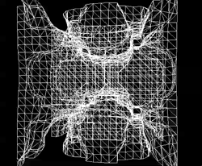
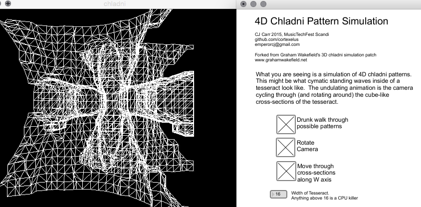

# 4D-Chladni

Simulation of Chladni patterns in 4D with Max/Msp/Jitter. This may be what standing waves in a tesseract look like. 

[Watch Video](https://www.youtube.com/watch?v=pHE5uHkH0JM)

What you are seeing are cymatic standing waves inside tesseracts. They produce beautiful four dimensional chladni patterns. The undulating animation is the camera cycling through (and rotating around) the cube-like cross-sections of the tesseract. 

4D Chladni Max/MSP/Jitter patch created by CJ Carr, forked from [Graham Wakefield's](http://www.grahamwakefield.net) 3D simulation patch

One of three winners of Music Tech Fest Cymatics Challenge. My prize: FREE airfare/hotel to Umeå, Sweden for MusicTechFest Scandi! 

[MTF Cymatics Challenge](http://musictechfest.net/mtfcymatics/)

[#MTFScandi Cymatics Challenge Presentations](https://www.youtube.com/watch?v=39vWJOp7BAM)

### todo 

* Make nicer, higher resolution, smoother renders. 
* Render using stereographic projection
* Figure out how to 3D print some of these shapes
